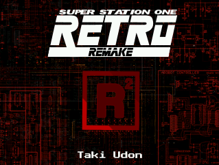
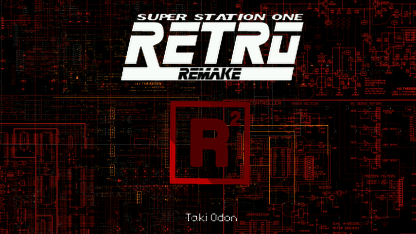

# SuperStation One / Retro Remake — MiSTer Idle Screensaver

An idle-triggered screensaver for [MiSTer FPGA](https://github.com/MiSTer-devel/Main_MiSTer) that displays a
custom animated **SuperStation One / Retro Remake** boot intro after your system sits idle at the menu
(stock MiSTer menu or Console Mode). Written as a small, dependency-free daemon + framebuffer renderer in C,
with a Python asset pipeline for generating the animation itself.


---

## Preview

| 4:3 | 16:9 |
|---|---|
|  |  |

---

## Features

- **Genuine idle detection**, not a naive "any input" check — real key/button presses and mouse movement
  count as activity; small analog stick drift/electrical noise does not, using the same deadzone threshold
  ([Super Attract Mode](https://github.com/mrchrisster/MiSTer_SAM)'s `AXIS_DEADZONE = 2000`) that inspired it.
- **Never interrupts a running game** — only triggers while sitting at the menu core
  (checked via `/tmp/CORENAME`), which also correctly covers third-party frontends like Console Mode.
- **Single-instance safe** — a PID lock prevents the watcher itself from ever running twice, and the
  screensaver process can't be launched concurrently either.
- **No external dependencies** — statically-linked ARM binaries, no SDL, no Python, no shell dependencies
  beyond `bash` at runtime. Talks directly to `/dev/fb0` and `/dev/input/event*`.
- **Two aspect ratios included** — a 4:3-native render and a proper 16:9 widescreen render (not a
  letterboxed crop — the composition is re-rendered wider so the background genuinely fills the screen).
- **Configurable idle timeout** — 1/2/5/10/15/30 minutes, or disabled entirely, picked at install time.
- **Simple settings-menu installer**, in the spirit of `update_all` — uses `dialog`/`whiptail` if available,
  falls back to plain numbered prompts otherwise.

## How it works

```
user-startup.sh (boot)
        │
        ▼
  idle_watcher  ──────────────────────────────┐
  (background daemon)                          │ polls /dev/input/event*
        │                                       │ every 2s, deadzone-filtered
        │ idle_seconds elapsed AND               
        │ /tmp/CORENAME == "MENU"
        ▼
  intro_screensaver.sh  →  intro_screensaver (binary)
        │                        │
        │                        ▼
        │                  draws directly to /dev/fb0,
        │                  scaled to fit, until any real input
        ▼
  control returns to whatever was already
  running (menu / Console Mode) — the
  screensaver only ever draws an overlay,
  it never switches cores, so there's
  nothing else to "return to"
```

`intro_screensaver` streams pre-rendered RGB565 frames (baked once by the Python pipeline, see below)
straight into RAM at startup and blits them to the framebuffer each frame — no per-frame decoding, no
codec, so it stays light on the HPS's ARM CPU.

## Installation

1. Download the latest release zip and extract it — you'll get an `sso_ss/` folder.
2. Copy `sso_ss/` anywhere on your MiSTer (e.g. the Scripts menu, or over SSH).
3. Run the installer:
   ```sh
   bash sso_ss/install_ssone_screensaver.sh
   ```
4. In the menu, set your **aspect ratio** and **idle timeout**, then choose **Install / Apply Settings**.
   This copies everything into `/media/fat/linux/sso/`, writes the config, and hooks
   `/media/fat/linux/user-startup.sh` so it starts automatically on every boot.
5. Reboot (or start it immediately without rebooting — the installer prints the exact command).

Re-running the installer at any time is safe — it always cleanly stops whatever's currently running before
applying new settings, so nothing stacks up or overlaps.

### Uninstalling

Run the installer and choose **Uninstall**, or do it manually:

```sh
ps | grep idle_watcher            # kill any pid shown
# remove the added lines from /media/fat/linux/user-startup.sh
rm -rf /media/fat/linux/sso
```

## Configuration

Settings live in `/media/fat/linux/sso/ssone_screensaver.conf`, written by the installer:

```sh
ASPECT="16x9"            # or "4x3"
TIMEOUT_SECONDS="300"    # or "-1" to disable
TIMEOUT_LABEL="5 minutes"
```

You generally shouldn't need to hand-edit this — re-run the installer instead.

## Building from source

### The C programs

```sh
# cross-compile for MiSTer's ARM HPS (statically linked, no runtime deps)
arm-linux-gnueabihf-gcc -static -O2 -Wall -o idle_watcher idle_watcher.c
arm-linux-gnueabihf-gcc -static -O2 -Wall -o intro_screensaver bounce_screensaver.c
arm-linux-gnueabihf-strip idle_watcher intro_screensaver
```

### The animation data

Frame data isn't hand-authored — it's rendered once by a Python/Pillow compositing pipeline
(`gen_frames_43.py` / `gen_frames_169.py`) from source layers (schematic background art + logo PNGs),
then packed into a small custom binary format the C player reads directly:

```
"SSIF" magic (4 bytes)
uint32 frame_count, width, height
uint16[frame_count]  per-frame duration (ms)
RGB565 pixel data, frame_count frames of width*height*2 bytes each
```

Regenerate either aspect ratio with:

```sh
python3 gen_frames_43.py     # -> intro_frames_4x3.bin  (319x241)
python3 gen_frames_169.py    # -> intro_frames_169.bin  (856x482)
```

## Project structure

```
sso_ss/
├── idle_watcher                  # background daemon (C, ARM static binary)
├── intro_screensaver             # framebuffer animation player (C, ARM static binary)
├── intro_screensaver.sh          # launcher — picks 4:3/16:9 asset from config
├── install_ssone_screensaver.sh  # settings menu + installer
├── intro_frames_4x3.bin          # pre-rendered animation, 4:3
├── intro_frames_169.bin          # pre-rendered animation, 16:9
└── ssone_screensaver.conf        # written by the installer
```

## Credits

- [MiSTer FPGA](https://github.com/MiSTer-devel/Main_MiSTer) project
- [MiSTer Super Attract Mode](https://github.com/mrchrisster/MiSTer_SAM) by mrchrisster — the reference
  for genuine input-noise filtering that made idle detection actually reliable here
- Retro Remake / SuperStation One branding and artwork

## License

MIT — see [LICENSE](LICENSE).
